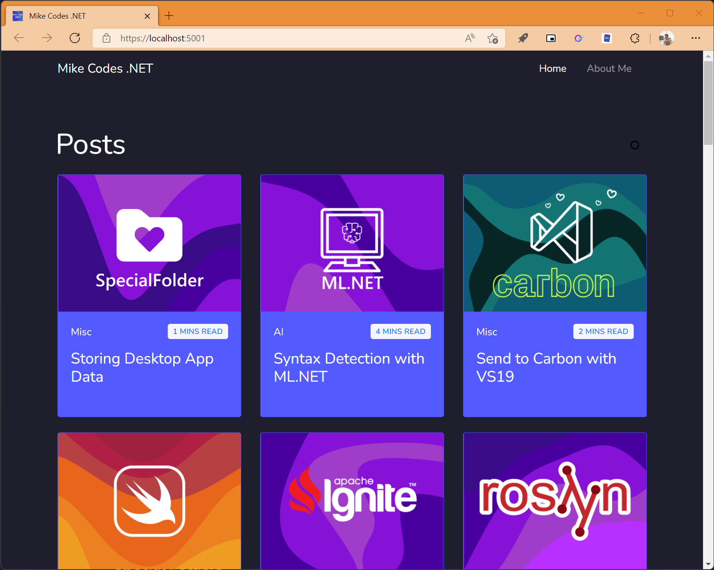
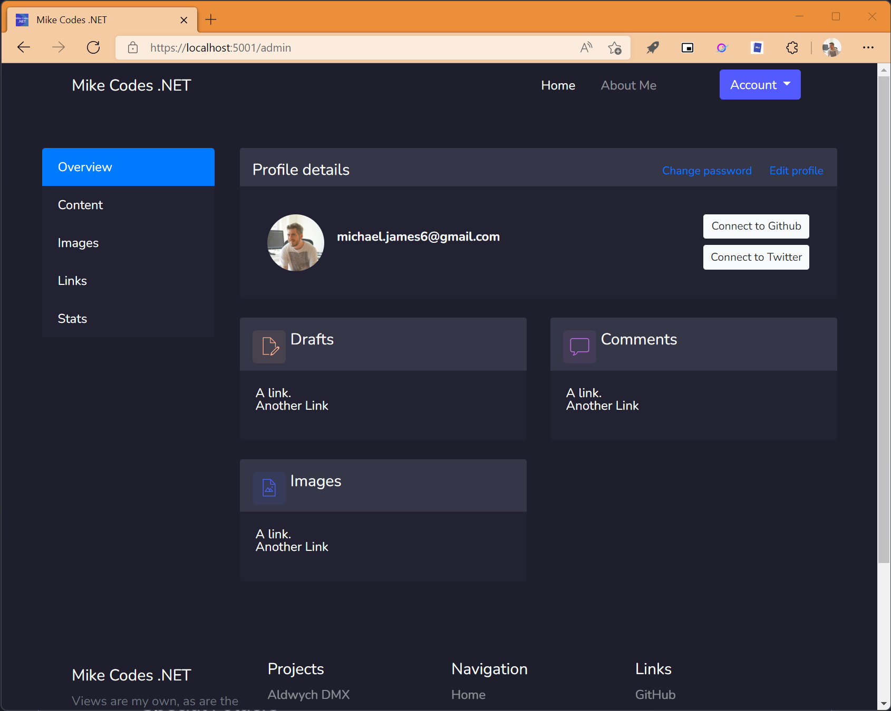
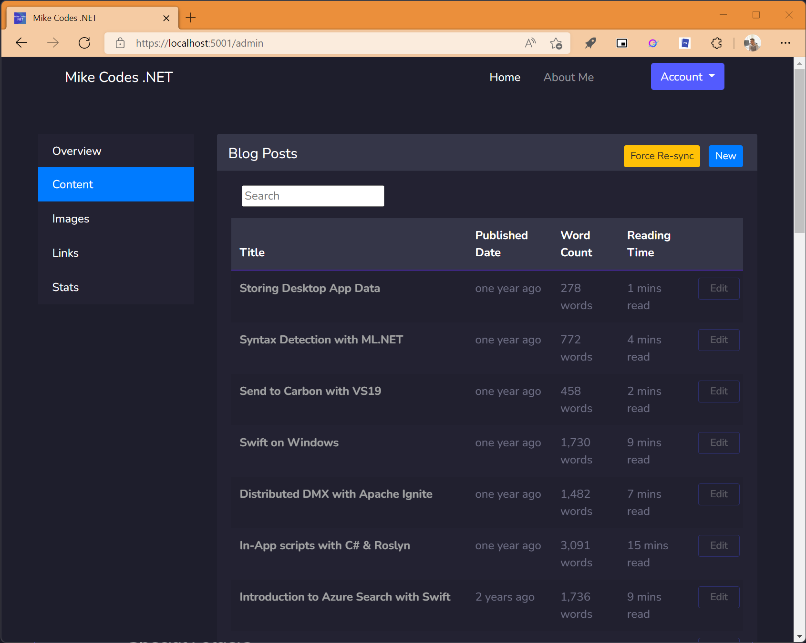
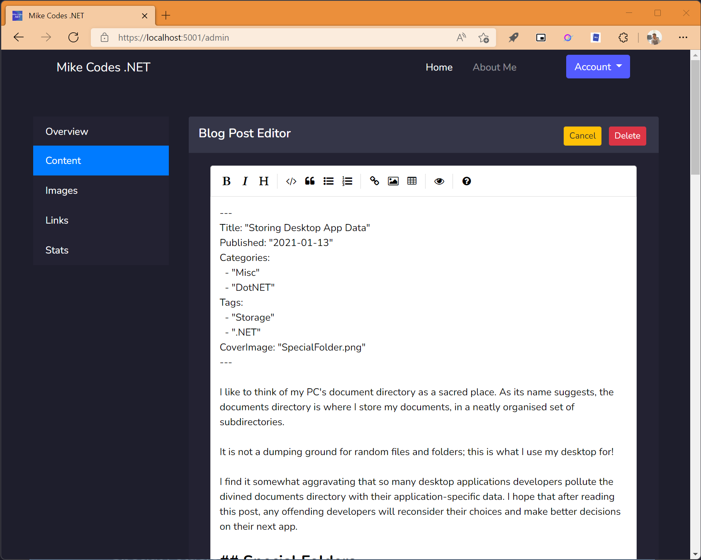

# MikeCodes.NET Blazor (Server) blog 

This is a slightly simplified (only in terms of styling) version of my [personal blog ](https://mikecodes.net), developed with Blazor Service and .NET 6. 

I created this in order to learn Blazor and migrate away from WordPress. 

## How it works

The blog is deployed and running in [Azure](https://azure.microsoft.com/) using [App Service](https://azure.microsoft.com/en-gb/free/apps/search/?&ef_id=CjwKCAjwur-SBhB6EiwA5sKtjmOtEg9YxY8i5CLYJZdz37mALbdvkwie-P3LguSlnPmAPflig3tTJhoCnAQQAvD_BwE:G:s&OCID=AID2200274_SEM_CjwKCAjwur-SBhB6EiwA5sKtjmOtEg9YxY8i5CLYJZdz37mALbdvkwie-P3LguSlnPmAPflig3tTJhoCnAQQAvD_BwE:G:s&gclid=CjwKCAjwur-SBhB6EiwA5sKtjmOtEg9YxY8i5CLYJZdz37mALbdvkwie-P3LguSlnPmAPflig3tTJhoCnAQQAvD_BwE). It currently only depends on [Azure Storage](https://azure.microsoft.com/en-gb/free/storage/search/?&ef_id=CjwKCAjwur-SBhB6EiwA5sKtjqAvxkO51wcPJFjhKv5MvowfUw9NxdDI76NcSh0B_yDWUMb_qGBBBRoCjqoQAvD_BwE:G:s&OCID=AID2200274_SEM_CjwKCAjwur-SBhB6EiwA5sKtjqAvxkO51wcPJFjhKv5MvowfUw9NxdDI76NcSh0B_yDWUMb_qGBBBRoCjqoQAvD_BwE:G:s&gclid=CjwKCAjwur-SBhB6EiwA5sKtjqAvxkO51wcPJFjhKv5MvowfUw9NxdDI76NcSh0B_yDWUMb_qGBBBRoCjqoQAvD_BwE), though I'm in the process of implementing [Text analytics](https://azure.microsoft.com/en-gb/services/cognitive-services/text-analytics/#overview) and [Azure Cognitive Search](https://azure.microsoft.com/en-gb/services/search/?&ef_id=CjwKCAjwur-SBhB6EiwA5sKtjk7e_9Lgx_7cBuqgdcblI-3tUGmnK7W1nyUIdDKoFw43ivIHKcAFUBoCm5gQAvD_BwE:G:s&OCID=AID2200274_SEM_CjwKCAjwur-SBhB6EiwA5sKtjk7e_9Lgx_7cBuqgdcblI-3tUGmnK7W1nyUIdDKoFw43ivIHKcAFUBoCm5gQAvD_BwE:G:s&gclid=CjwKCAjwur-SBhB6EiwA5sKtjk7e_9Lgx_7cBuqgdcblI-3tUGmnK7W1nyUIdDKoFw43ivIHKcAFUBoCm5gQAvD_BwE).

---

## Content Creation

The content authoring aspect of the blog are a work in progress. 

Blog posts are authored using Markdown and uploaded to Azure Storage as blobs. 

When the Azure Storage detect a change, it triggers a webhook in the blog that then starts rebuilding the local SQLite database. 

### Admin Area 

### Post Management 

### Post Editor 

